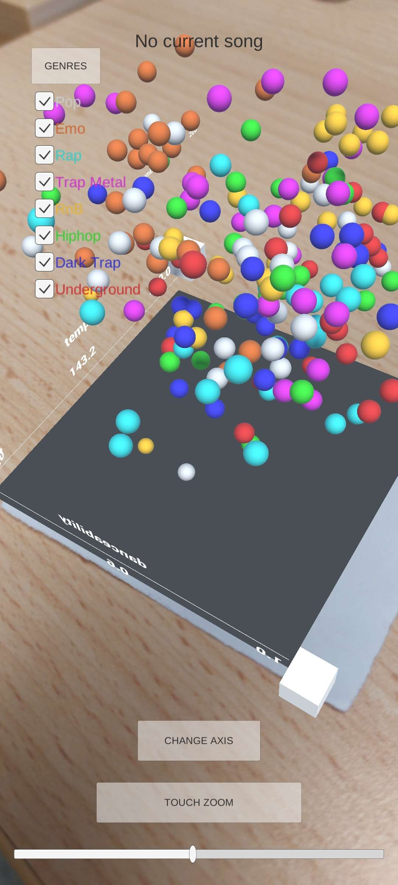

# Unity AR Data Visualization

An augmented reality (AR) application for interactive 3D data visualization,
developed in Unity as part of the **3D Computer Graphics** course at
École Polytechnique / Nantes University.

## Overview
The application renders a 3D scatter plot anchored to a detected AR marker.
Once the marker is recognized by the camera, a virtual data visualization
appears in the real world and can be explored interactively.

## Features
- Marker-based AR visualization
- 3D scatter plot rendering
- Interactive filtering by category
- Rotation, zooming, and axis switching
- Real-time user interaction through touch gestures

## Demo
*(Video will be added soon)*  
Current screenshot preview:

## Technologies
- Unity (C#)
- AR Foundation / marker-based tracking
- Custom 3D interaction logic

## Context
This project was developed as a coursework assignment focused on:
- 3D graphics pipelines
- Human–computer interaction
- AR-based data exploration

## Notes
The project is intended as a technical and conceptual demonstration rather
than a production-ready AR system.
